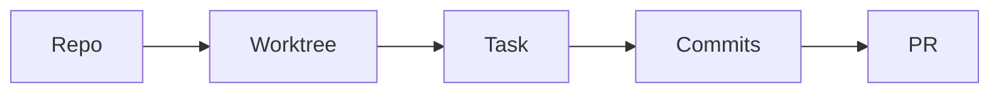

# Concepts

geno-dev provides a set of skills that form a development lifecycle. This page explains the key abstractions and how they connect.

## The Development Lifecycle


```mermaid
graph LR
    A[Repo] --> B[Worktree]
    B --> C[Task]
    C --> D[Commits]
    D --> E[PR]
```

A repo can have multiple **worktrees** for parallel branches. **Tasks** track what you're working on inside a worktree. When the work is done, messy **commits** are rewritten into a clean narrative, then shipped as a **PR**.

You can use any skill standalone — commit rewriting works without tasks. But they're designed to compose.

## Worktrees

Git worktrees let you check out multiple branches of the same repo simultaneously, each in its own directory. geno-dev manages worktree placement so they stay organized.

**Workspace mode** (inside a workspace):

```
~/code-red/my-feature-ws/
  .geno/
    worktrees/
      geno-dev/
        feature/auth/      # worktree for feature/auth branch
        fix/typo/           # worktree for fix/typo branch
  geno-dev/                 # main checkout
```

**Inline mode** (no workspace):

```
~/projects/geno-dev/
  .geno/
    worktrees/
      feature/auth/
      fix/typo/
```

### Safety

The skill automatically protects:

- **Claude Code worktrees** (`.claude/worktrees/`) — never touched
- **geno-tools worktrees** (`~/.geno/`) — warned before any action

No tracked files are ever modified — no `.gitignore` edits, no config changes.

**Managed by:** [`/geno-dev-worktrees-manage`](commands.md#manage-worktrees)

## Tasks

Tasks are tracked in [geno-notes](https://github.com/42euge/geno-notes), a project journal system. Each task has a lifecycle:

```
Backlog → Active → Done (or Abandoned)
```

When you run `/geno-dev-tasks-start`, the skill:

1. Reads your geno-notes task list
2. Matches a task by description or lets you pick one
3. Assesses scope — small tasks skip planning, larger ones enter plan mode
4. Executes the work, logging milestones to the journal
5. Marks the task done with a summary

Plans are saved to `geno-notes/plans/<task-slug>.md` for continuity across sessions.

!!! info "Prerequisite"
    `/geno-dev-tasks-start` requires geno-notes. Run `geno-notes init --project` in your repo to set up a project-scope journal. Install: `geno-tools install geno-notes`

**Managed by:** [`/geno-dev-tasks-start`](commands.md#start-task)

## Commits as Narrative

After work is done, the commit history is usually messy — WIP saves, fixups, debug experiments. `/geno-dev-commits-rewrite` transforms that into a logical story.

The philosophy:

- Each commit is a single logical unit that makes sense on its own
- Commits build on each other: scaffold → core → implementation → polish
- 3-8 commits is the sweet spot
- Explain the "why", not just the "what"

A `backup-before-rewrite` branch is always created before modifying history. The skill verifies no content is lost by diffing against the backup.

**Managed by:** [`/geno-dev-commits-rewrite`](commands.md#rewrite-commit-history)

## Sessions

An agent session accumulates rich context — files touched, commands run, decisions made. When a session ends or needs to be handed off, `/geno-dev-sessions-fork` extracts that context into a portable markdown document.

The output includes:

- Environment (working directory, branch, model)
- Files modified and read
- Recent commands (deduplicated)
- Conversation history

Start a new session with this document and it picks up where the original left off.

!!! info "Prerequisite"
    `/geno-dev-sessions-fork` requires [geno-mon](https://github.com/42euge/geno-mon), a Claude Code session monitor. It must be installed and available on `$PATH`.

**Managed by:** [`/geno-dev-sessions-fork`](commands.md#fork-session)
